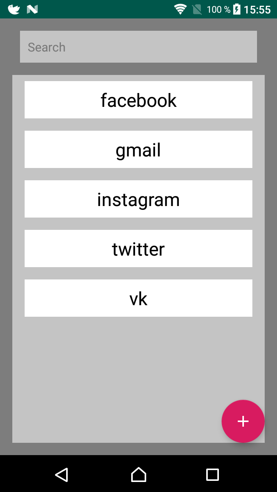
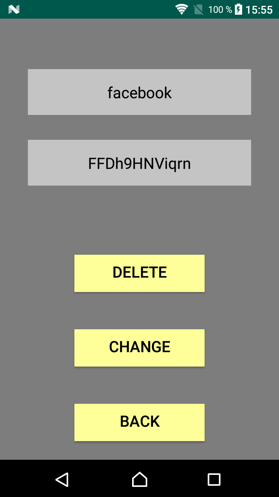

# PasswordWallet

PasswordWallet is an application for creating and storing passwords for any resource.

## Installation

To use PasswordWallet, you need a mobile device with Android operating system version 4.4 or higher and Internet access.

## Screenshots

## Library

Project is created with:
* OkHttp version: 4.1.0
* Retrofit version: 2.6.1
* RxJava version: 2.2.10

## Versioning
1.0
